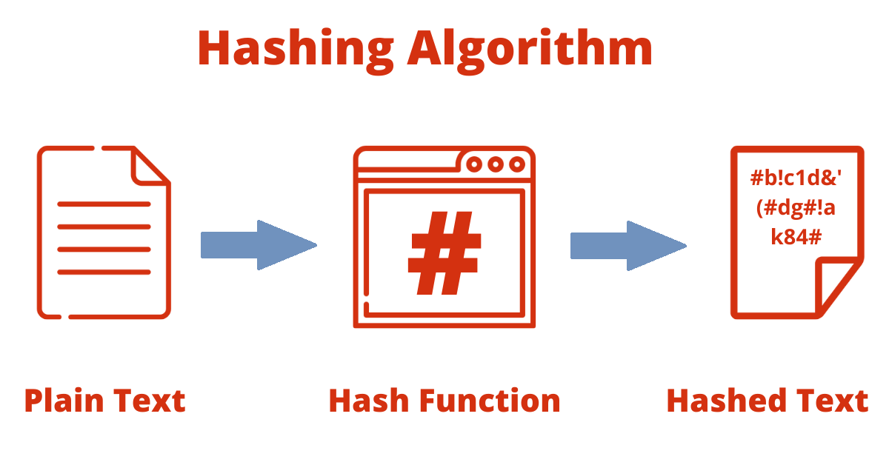
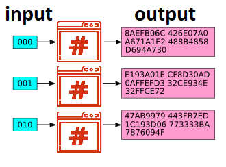

# Secure Hash Algorithm (SHA) Family: A Technical Deep Dive

## 1. Introduction to Hash Functions

Cryptographic hash functions are **core building blocks** of modern cryptography. They ensure data integrity, enable digital signatures, protect passwords, and power blockchain consensus mechanisms. Without them, secure communication and authentication on the internet would be nearly impossible.

A **hash function** is a deterministic algorithm that transforms input data of any length into a fixed-length output, called a **hash value** or **digest**. Unlike encryption, hash functions are **one-way functions** — meaning it is computationally infeasible to retrieve the original input from its hash.

### 1.1 Definition of a Hash Function

Formally, a hash function **H** maps an input **x** from a large domain **D** to a fixed-size output in a range **R**:

$$
H: D \to R
$$

Where:
- **D** = set of all possible input messages (binary strings of arbitrary length).
- **R** = set of all possible hash values (binary strings of fixed length, e.g., 256 bits).

The output **h = H(x)** acts as a **unique fingerprint** of the input data.

### 1.2 Essential Security Properties

A secure cryptographic hash function must satisfy:

| Property | Description |
|----------|-------------|
| **Determinism** | The same input always produces the same output. |
| **Pre-image Resistance** | Given **h**, it is infeasible to find any **x** such that **H(x) = h**. |
| **Second Pre-image Resistance** | Given **x₁**, it is infeasible to find **x₂ ≠ x₁** where **H(x₁) = H(x₂)**. |
| **Collision Resistance** | It is infeasible to find any two distinct inputs producing the same hash. |
| **Avalanche Effect** | A tiny change in input results in a drastically different output. |

These properties protect against forgery, tampering, and many forms of attack.

### 1.3 Practical Use Cases

Hash functions are used in:

- **Data Integrity Verification** — Ensures files or messages haven't changed.
- **Digital Signatures** — Reduces computational cost and keeps data confidential.
- **Password Storage (Hash + Salt)** — Prevents dictionary and rainbow table attacks.
- **Message Authentication Codes (HMACs)** — Combines hashing with a secret key.
- **Blockchain & Cryptocurrencies** — Powers Proof-of-Work and transaction immutability.
- **Proof-of-Work Systems** — Prevents spam and ensures fairness in distributed networks.

### 1.4 Historical Background

Early algorithms like **MD4**, **MD5**, and **SHA-0** were widely used but later broken due to collision attacks. This led to **SHA-1**, **SHA-2**, and eventually **SHA-3**.  
The **SHA family** was developed by **NIST** with contributions from the **NSA**, and it has become a global cryptographic standard.

---

## 1.5 JavaScript Example — SHA-256 with Node.js

In Node.js, you can use the built-in **crypto** module:

~~~~javascript
// SHA-256 Hash Example (Node.js)
const crypto = require('crypto');

function sha256Hash(data) {
  return crypto.createHash('sha256').update(data).digest('hex');
}

console.log(sha256Hash("Hello World"));
// Example output: a591a6d40bf420404a011733cfb7b190...

~~~~

## 1.6 JavaScript Example — SHA-256 in the Browser (Web Crypto API)
Modern browsers provide the Web Crypto API for secure hashing without external libraries:

~~~~html
<!DOCTYPE html>
<html>
<head>
  <meta charset="UTF-8">
  <title>SHA-256 Demo</title>
</head>
<body>
  <h2>SHA-256 Hash Demo (Web Crypto API)</h2>
  <input type="text" id="inputText" placeholder="Enter text" />
  <button onclick="hashText()">Generate Hash</button>
  <pre id="output"></pre>

  
</body>
</html>

~~~~