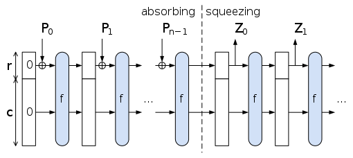

## 3. Technical Architecture of SHA-2 and SHA-3

This section provides a detailed technical overview of the internal structure and functioning of the two primary Secure Hash Algorithm families still considered secure: **SHA-2** and **SHA-3**.

---

### 3.1 SHA-2: Internal Structure

SHA-2 is based on the **Merkle–Damgård construction**, using the **Davies–Meyer compression function**. It processes messages in fixed-size blocks and produces a fixed-size output hash.

#### 3.1.1 High-Level Process

1. **Preprocessing**  
   - **Padding**: Appends a '1' bit, followed by enough '0' bits, and finally the length of the original message to make the total length a multiple of the block size.  
   - **Parsing**: Divides the padded message into **N** blocks of **512 bits** (for SHA-256) or **1024 bits** (for SHA-512).

2. **Initialization**  
   - Initializes eight working variables (a-h) with predefined **initial hash values (IVs)** derived from fractional parts of square roots of prime numbers.

3. **Compression Function**  
   - For each block, applies **64 rounds (SHA-256)** or **80 rounds (SHA-512)** of mixing functions.  
   - Each round uses:  
     - **Message schedule array (W[t])**  
     - **Round constants (K[t])** derived from fractional parts of cube roots of prime numbers.  
     - **Bitwise operations**: AND, OR, XOR, right rotate, right shift.

4. **Finalization**  
   - Updates the hash value by adding the working variables back into the current hash state.  
   - After processing all message blocks, the final concatenated hash is output.

#### 3.1.2 Compression Function Formula

For each round **t**:

~~~~
T1 = h + Σ1(e) + Ch(e, f, g) + K[t] + W[t]
T2 = Σ0(a) + Maj(a, b, c)

h = g
g = f
f = e
e = d + T1
d = c
c = b
b = a
a = T1 + T2

# Compression Function - Round t

T1 = h + Σ1(e) + Ch(e, f, g) + K[t] + W[t]  
T2 = Σ0(a) + Maj(a, b, c)  

Update working variables:  
h ← g  
g ← f  
f ← e  
e ← d + T1  
d ← c  
c ← b  
b ← a  
a ← T1 + T2

~~~~

Where:  
- **Ch(x, y, z) = (x AND y) XOR (¬x AND z)**  
- **Maj(x, y, z) = (x AND y) XOR (x AND z) XOR (y AND z)**  
- **Σ0(x) and Σ1(x)** are functions involving bitwise rotations and shifts.

#### 3.1.3 SHA-2 Workflow Diagram

~~~~mermaid
flowchart LR
    A[Input Message] --> B[Padding: append 1 and zeros and length]
    B --> C[Parse into 512 or 1024 bit blocks]
    C --> D[Initialize variables a to h]
    D --> E[Compression: 64 or 80 rounds]
    E --> F[Update hash values]
   
~~~~

---

### 3.2 SHA-3: Sponge Construction

Unlike SHA-2, SHA-3 is based on the **Keccak sponge construction**, which is fundamentally different from Merkle–Damgård.

#### 3.2.1 High-Level Process

1. **Padding**  
   - The message is padded using the **multi-rate padding (pad10*1)** rule.

2. **Absorbing Phase**  
   - The padded message is divided into blocks of size **r** (rate).  
   - Each block is XORed into the **state matrix** followed by application of the **Keccak-f permutation function**.

3. **Squeezing Phase**  
   - After absorbing, output bits are extracted from the state.  
   - If more output is needed, the Keccak-f permutation is applied again to produce additional output blocks.

#### 3.2.2 Internal State

- Represented as a 3D array (5x5 lanes) of 64-bit words for SHA3-512.  
- Total state size: **1600 bits** (w = 64-bit words).

#### 3.2.3 Keccak-f Permutation Steps

Each round of Keccak-f involves:

1. **Theta**: Mixes bits across all lanes using XOR operations.  
2. **Rho**: Bitwise rotations of individual lanes.  
3. **Pi**: Permutes the positions of lanes.  
4. **Chi**: Applies non-linear Boolean functions.  
5. **Iota**: Adds round constants to break symmetry.

#### 3.2.4 SHA-3 Variants Parameters

| SHA-3 Variant | Output Length | Capacity (c) | Rate (r = b - c) |
|---------------|---------------|--------------|------------------|
| SHA3-224      | 224 bits      | 448 bits     | 1152 bits        |
| SHA3-256      | 256 bits      | 512 bits     | 1088 bits        |
| SHA3-384      | 384 bits      | 768 bits     | 832 bits         |
| SHA3-512      | 512 bits      | 1024 bits    | 576 bits         |

The **capacity (c)** parameter controls security strength (e.g., SHA3-256 offers 128-bit collision resistance).

#### 3.2.5 Keccak-f Round Steps Diagram

~~~~mermaid
flowchart TB
    Theta --> Rho --> Pi --> Chi --> Iota
    subgraph "Keccak-f Round Steps"
        Theta["Theta: XOR bits across lanes"]
        Rho["Rho: Bitwise rotations"]
        Pi["Pi: Lane permutations"]
        Chi["Chi: Non-linear Boolean functions"]
        Iota["Iota: Add round constants"]
    end
~~~~

#### 3.2.6 Sponge Construction Illustration

*Source: Wikimedia Commons - Keccak Sponge Construction*

---

### 3.3 Key Differences Between SHA-2 and SHA-3

| Feature             | SHA-2                                   | SHA-3                                      |
|---------------------|-----------------------------------------|--------------------------------------------|
| Construction        | Merkle–Damgård                          | Sponge construction                       |
| Compression Method  | Davies–Meyer                            | Keccak-f permutation                      |
| Security Features   | Vulnerable to length-extension attacks  | Resistant to length-extension attacks     |
| Flexibility         | Fixed-purpose hash                      | Supports XOFs and other cryptographic primitives |
| Adoption            | Industry standard (TLS, blockchain, etc) | Slowly growing, future-proof alternative  |

---

### 3.4 Summary Diagram: SHA-2 vs SHA-3 Architectures

~~~~mermaid
graph TD
    A[Input Message] --> B_SHA2[SHA-2: Merkle–Damgård]
    A --> B_SHA3[SHA-3: Sponge Construction]
    
    B_SHA2 --> C1[Padding + Parsing]
    C1 --> D1[Compression Function (Davies–Meyer)]
    D1 --> E1[Hash Output]

    B_SHA3 --> C2[Multi-rate Padding]
    C2 --> D2[Absorb Phase (XOR + Keccak-f)]
    D2 --> E2[Squeeze Phase (Output Extraction)]
    E2 --> F2[Hash Output]
~~~~

---

### Suggested Images for Illustration

- **SHA-2 Block Processing Diagram:** Showing padding, parsing, and compression rounds.  
- **Keccak Sponge Construction:** Visualize the absorb and squeeze phases with the state matrix.  
- **Comparison Table Image:** Highlighting key architectural differences.  

These visuals can greatly enhance reader understanding.
